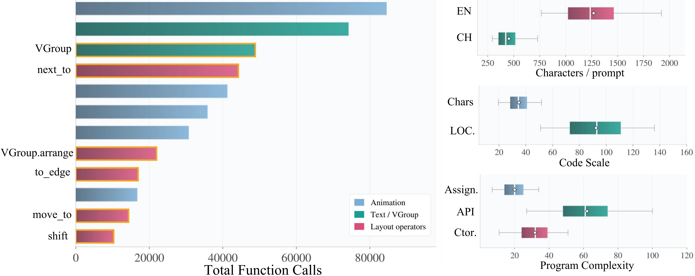
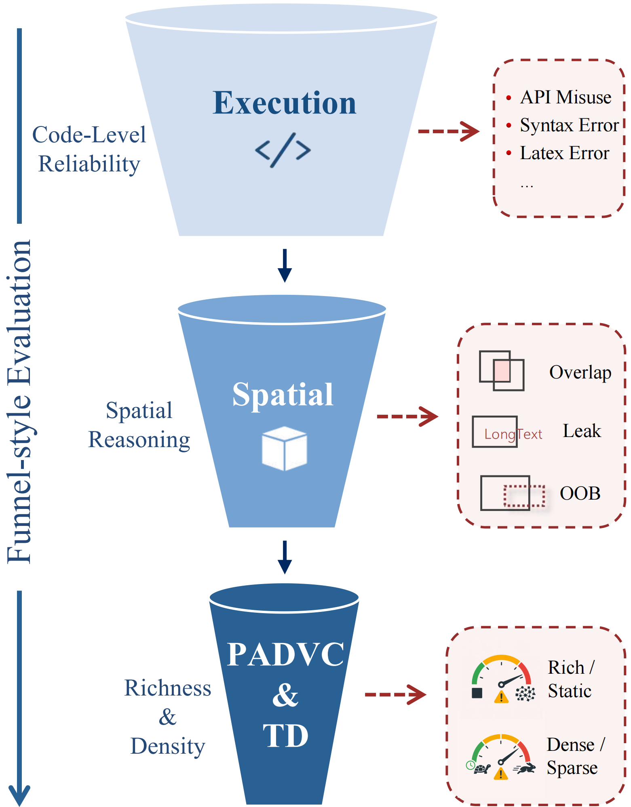

<h1 align="center">
  
  PRISM: A Benchmark for Programmatic Spatial-Temporal Reasoning
</h1>


<p align="center">
  
  
  
  
</p>


<p align="center">
  <a href="figs/PRISM.pdf">
    
  </a>
</p>


## ✨ Overview

PRISM is a benchmark for studying programmatic spatial-temporal reasoning in Manim code generation. This repository bundles both the released dataset and an evaluation-first toolkit for rendering, deterministic spatial audit, PADVC / TD scoring, and text-expansion analysis.

The released PRISM dataset is bundled under `data/`. It contains 10,372 examples in total, with 5,199 English prompts and 5,173 Chinese prompts.

<p align="center">
  <a href="figs/PRISM.pdf">
    
  </a>
</p>

> [!NOTE]
> PRISM bundles both the released bilingual benchmark and the full evaluation toolkit. If you only want to score an existing Manim output directory, you can skip the optional generation components entirely.


## 🧪 Evaluation

<p align="center">
  
</p>

PRISM evaluates outputs through a progressive funnel:

- `Execution`: code-level reliability, including API misuse, syntax errors, and LaTeX failures.
- `Spatial`: geometric reasoning quality, including overlap, leak, and out-of-bounds issues.
- `PADVC & TD`: visual richness and temporal density once basic correctness is satisfied.
  
> [!WARNING]
> `PADVC_center` and `TD_center` are not plug-and-play defaults. To obtain meaningful comparisons, prepare the required local OCR / embedding assets and fit reference parameters on your own curated reference set first.

## 🧭 Workflow

```text
Generated Manim scripts (.py)
        |
        v
render_directory.py  ->  videos/*.mp4
        |
        v
audit_batch.py       ->  audit/results.json
        |
        +--> score_padvc.py  ->  padvc_final/padvc_scores.jsonl
        |
        +--> score_td.py     ->  td_final/td_center_scores.jsonl
        |
        +--> compute_text_expansion.py  ->  info_expand_final/
```

The main end-to-end entrypoint is:

```bash
scripts/run_evaluation_pipeline.sh \
  your_model_run/cleaned_scripts \
  results/eval_your_model \
  your_model_run/task_manifest.json \
  data/your_prompts.jsonl \
  results/reference_padvc/padvc_norm_params.json \
  results/reference_td/td_center_params.json \
  your_model_name
```

## 📦 Repository Layout

| Path | Purpose |
| --- | --- |
| `scripts/` | Command-line tools for evaluation, metric fitting, and optional generation |
| `manim_bench/llm_call/` | Minimal LLM client wrapper used by the optional generation flow |
| `docs/` | Technical notes for data format, metrics, and spatial audit semantics |
| `examples/` | Toy inputs and example configs for smoke tests |
| `data/` | Released PRISM dataset plus local dataset workspace |
| `results/` | Default local workspace for generated outputs and summaries |

## 🚀 Quickstart

### 1. Install Python dependencies

```bash
python3 -m venv .venv
source .venv/bin/activate
python -m pip install --upgrade pip
python -m pip install -r requirements.txt
```

### 2. Check the runtime

```bash
python scripts/check_environment.py
```

### 3. Prepare OCR and embedding models for PADVC

Default OCR backend:

- `rapidocr-onnxruntime`
- optional fallback: `paddleocr`

Embedding models used by `scripts/padvc.py`:

- Chinese: `shibing624/text2vec-base-chinese`
- English / multilingual: `sentence-transformers/paraphrase-multilingual-MiniLM-L12-v2`

The PADVC pipeline defaults to offline Hugging Face mode:

```bash
export PADVC_HF_CACHE=/path/to/huggingface/hub
# or point directly to local snapshots
export PADVC_ZH_MODEL=/path/to/text2vec-base-chinese
export PADVC_EN_MODEL=/path/to/paraphrase-multilingual-MiniLM-L12-v2

export PADVC_OCR_BACKEND=rapidocr
export PADVC_OCR_CACHE_DIR=results/ocr_cache
export PADVC_DEBUG=0
```

### 4. Evaluate an existing model run

Expected inputs:

- `your_model_run/cleaned_scripts/*.py`
- `your_model_run/task_manifest.json`
- a prompt JSONL such as `data/your_prompts.jsonl`
- fitted reference parameters for PADVC and TD

Then run:

```bash
scripts/run_evaluation_pipeline.sh \
  your_model_run/cleaned_scripts \
  results/eval_your_model \
  your_model_run/task_manifest.json \
  data/your_prompts.jsonl \
  results/reference_padvc/padvc_norm_params.json \
  results/reference_td/td_center_params.json \
  your_model_name
```

If your outputs were not produced by `scripts/generate_code.py`, prepare the minimal manifest and prompt JSONL formats described in [`docs/data_format.md`](docs/data_format.md).

## 🧪 Fit Reference Parameters

`PADVC_center` and `TD_center` require reference statistics fitted on your own curated reference set:

```bash
python scripts/fit_reference_padvc.py \
  --dataset-jsonl data/your_reference_dataset.jsonl \
  --video-root results/reference_videos \
  --output-dir results/reference_padvc

python scripts/fit_reference_td.py \
  --dataset-jsonl results/reference_padvc/padvc_reference_raw_scores.jsonl \
  --output-dir results/reference_td
```

The example files under `examples/params/` are placeholders for smoke tests only.

## 🤖 Optional Generation

If you also want to generate model outputs inside this repository:

```bash
cp manim_bench/llm_call/config.example.json manim_bench/llm_call/config.json
```

You can also choose a different config path:

```bash
export MANIM_BENCH_LLM_CONFIG=/path/to/config.json
```

Then run:

```bash
python scripts/generate_code.py \
  --input-jsonl examples/sample_prompts.jsonl \
  --instruction-field instruction \
  --model your-model-name \
  --workers 2 \
  --temperature 0.7 \
  --output-dir results/example_generation
```

## 🛠️ System Requirements

Recommended environment:

- Linux or macOS
- Python 3.10+
- Manim Community Edition 0.19.0
- FFmpeg
- Cairo / Pango / `pkg-config`
- LaTeX toolchain for `Tex` and `MathTex`
- CJK-capable fonts if you render Chinese text

<details>
<summary>Platform package examples</summary>

Ubuntu:

```bash
sudo apt-get update
sudo apt-get install -y \
  ffmpeg pkg-config libcairo2-dev libpango1.0-dev \
  texlive texlive-latex-extra texlive-fonts-recommended \
  texlive-xetex dvisvgm ghostscript \
  fonts-noto-cjk fontconfig
```

macOS:

```bash
brew install ffmpeg cairo pango pkg-config mactex-no-gui font-noto-sans-cjk
```

</details>

## 📚 Documentation

- [`docs/data_format.md`](docs/data_format.md): expected JSON / JSONL layouts
- [`docs/spatial_audit.md`](docs/spatial_audit.md): spatial-audit semantics
- [`docs/metrics.md`](docs/metrics.md): PADVC, TD, and text-expansion overview
- [`docs/code_error_taxonomy.md`](docs/code_error_taxonomy.md): code-failure categories
- [`scripts/README.md`](scripts/README.md): script inventory and command examples
